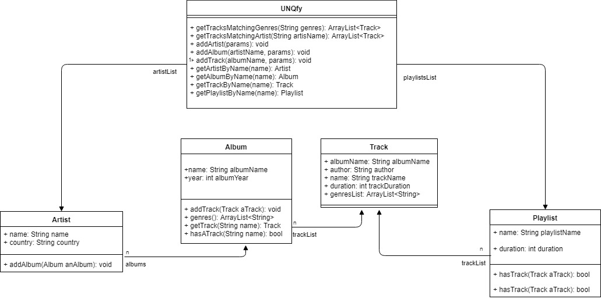

# UNQfyCloudPerezAvalos

# Uso de UNQfy
## Agregar artistas
### Para agregar artistas puede usar el comando addArtist, el comando recibe nombre y pais del artista a añadir, se invoca de la siguiente manera:

    node main.js addArtist Bob Jamaica
    node main.js addArtist Pablito Argentina

## Agregar album
### Para agregar albums puede usar el comando addAlbum, el comando recibe nombre de artista, nombre de album y año del album a añadir, se invoca de la siguiente manera:

    node main.js addAlbum Bob Exodus 1977

## Agregar tracks
### Para agregar tracks puede usar el comando addTrack, el comando recibe  nombre del album, nombre , duracion y genero del track a añadir, se invoca de la siguiente manera:

    node main.js addTrack Exodus Guiltiness 200 Reggae

## Busquedas
### UNQfy permite visualizar tracks, albums, artistas y playlists. Para eso puede usar los comandos getTrackByName, getAlbumByName, getArtistByName y getPlaylistByName. Estos comandos tienen como unico parametro el nombre del objeto a visualizar. e.g.:

    node main.js getArtistByName Bob
    node main.js getTrackByName Guiltiness
    node main.js getAlbumByName Exodus

## Busquedas en API's externas

    node main.js getTrackVideo Guiltiness
    node main.js getLyricsFromTrack Guiltiness

### UNQfy permite realizar busquedas de tracks segun el artista que los interpreta y segun su genero con los comandos getTracksMatchingArtist que recibe el nombre del artista por el cual buscar y getTracksMatchingGenres que recibe una lista de genero por los cuales realizar la busqueda.

    node main.js getTracksMatchingArtist Bob
    node main.js getTracksMatchingGenres "Reggae"

### Tambien permite realizar busquedas con un nombres parciales, no hace falta que se introdusca el nombre exacto

    node main.js getTracksMatchingParcialName Guil
    node main.js getAlbumsMatchingParcialName Ex
    node main.js getArtistsMatchingParcialName Bo

## UML 

